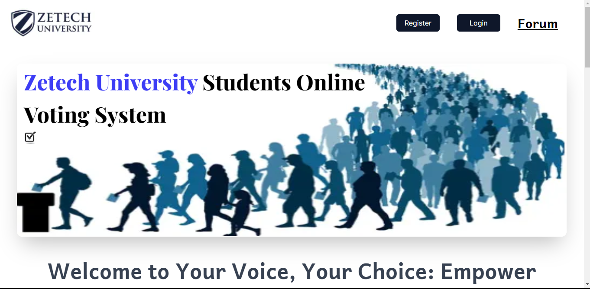
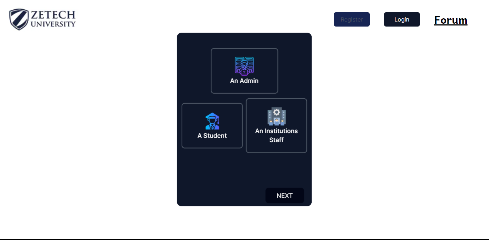
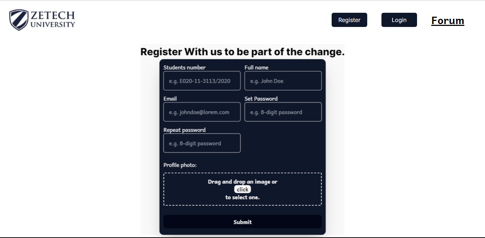
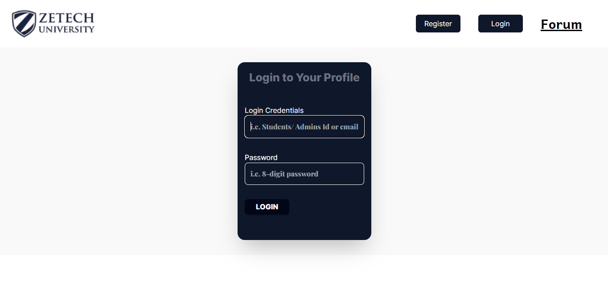
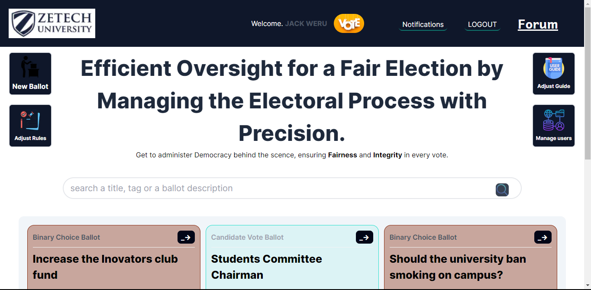
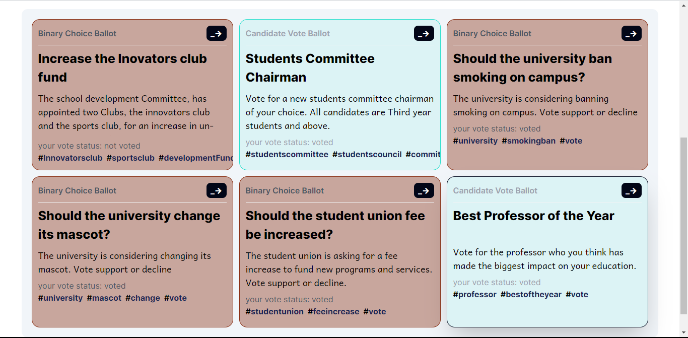
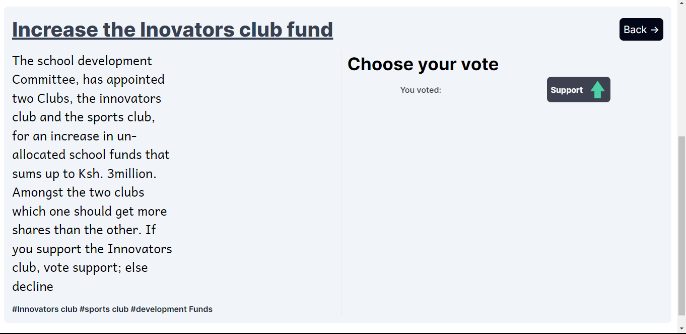

# Online Voters System - Next.js App

This project solution is an Online voters system purposely created to be used by university students. The project was built using (React)Next.js template, Next Auth, Cloudinary and MongoDB integration, and  Typescript. The system allows users to login or register (as either students, professor, or Admin). Login process is quite simple and intuitive, with auto role detection, for viewing intended users voters page. Read more to understand the solution at my GitHub repository: https://github.com/Jaweki/online-students-voting-system

## Table of contents

- [Overview](#overview)
  - [Getting Started](#getting-started)
  - [Screenshot](#screenshot)
  - [Links](#links)
- [My process](#my-process)
  - [Built with](#built-with)
  - [What I learned](#what-i-learned)
  - [Continued development](#continued-development)
  - [Useful resources](#useful-resources)
- [Author](#author)
- [Acknowledgments](#acknowledgments)

## Overview

### Getting Started

First, run the development server:

```bash
npm run dev
# or
yarn dev
# or
pnpm dev
# or
bun dev
```

To see specific project dependancies, take a look at the [package.json](./package.json) file in the root folder.

Open [http://localhost:3000](http://localhost:3000) with your browser to see the result.
This project uses [`next/font`](https://nextjs.org/docs/basic-features/font-optimization) to automatically optimize and load Inter, a custom Google Font.

### Screenshots










### Links

- Solution URL: [github repo](https://github.com/Jaweki/online-students-voting-system)
- Live Site URL: [deployment on vercel](https://online-students-voting-system.jaweki.com)

## My process

### Built with

- Mobile-first workflow
- [TypeScript](https://www.typescriptlang.org/) - a superset of javascript.
- [Tailwindcss](https://tailwindcss.com/) - CSS framework
- [React](https://reactjs.org/) - JS library
- [Next.js](https://nextjs.org/) - React framework
- [MongoDB](https://www.mongodb.com/) - Document oriented Database.
- [Cloudinary](https://cloudinary.com/) - Multimedia Storage

### What I learned

While this project was a great opportunity to sharpen my web development skills, the following skills were newly learnt:

- intergration of the web app to cloudinary. So, when a new user is registering in to the system, they upload their profile avatar(image). The image, is stored on cloudinary, and so the app had to intergrate with the api. Check out the code snipet below:

```js
const uploadImage = async () => {
  if (file) {
    try {
      const formData = new FormData();
      formData.append("file", file);
      formData.append("upload_preset", "upload_folder");

      const response = await fetch(
        "https://api.cloudinary.com/v1_1/cloud-name/image/upload",
        {
          method: "POST",
          body: formData,
        }
      );

      const data = await response.json();

      return data.secure_url;
    } catch (error) {
      console.error("Error uploading image: ", error);
      alert("Error Uploading image!");
    }
  }
};
```

- handling a Drag and drop on a html div element, which receives the image. [view code](./components/ImageUpload.tsx)

- Above all, the most interesting part of the project was designing and implementing the users config file document that is saved in the db. This was key especially when it comes to keeping track of votes a user paticipated in. view [mongoose schemas](./models/userToBallotSchema.ts).

### Continued development

This project is still under scheduled development. The following details will be implemented:

1.  The admin will have a grant to edit and/or delete old or unnecessary ballots,
2.  Implementation of Ballot analytics. For each ballot we need to know out of all users how many users have voted, probably view in a graph.
3.  For all users, Old and currently active ballots should be separated in the view.
4.  Implement search functionality for our web app.

Stay tunned for this updates soon.

### Useful reasources

- [Next.js dev Docs](https://nextjs.org/) - To know more about functionalities like routing, implementing loaders, or utilities like the Image element lazy loading
- [Next Auth Custom credentials provider](https://next-auth.js.org/providers/credentials#options) - To Learn more about how to intergrate an email custom credentials provider, or be able to keep track of user session as used in this web app, read the next auth docs.
- [Cloudinary](https://cloudinary.com/documentation/node_image_and_video_upload) - Familiarlize your self with this cloud storage solution, popular for its utility in multimedia storage.
- [MongoDB](https://www.mongodb.com/) - Learn more about document oriented, easy to implement and extend database.
- [vercel](https://vercel.com/) - For react and next.js project, vercel a aids in deployment of live site web apps. visit their site to learn more.

## Author

- Website - [Jack Weru | Jaweki](https://portfolio.jaweki.com)

## Acknowledgements

To begin with, am proud to have been able to complete and delive the mvp of this web app project. The University lecturers at Zetec university appreciated my solution, and recommended i develop it fully for it to be used by students.

More to that, great thanks to [AbdiRhamman Khalif Mohamed]() a student at Zetec university, who reach out to ask for a prototype of the initial designed system. With his co-operation we choose the right theme for the web app, user interactivity and responsiveness and people loved it.

## Learn More

To learn more about Next.js, take a look at the following resources:

- [Next.js Documentation](https://nextjs.org/docs) - learn about Next.js features and API.
- [Learn Next.js](https://nextjs.org/learn) - an interactive Next.js tutorial.

You can check out [the Next.js GitHub repository](https://github.com/vercel/next.js/) - your feedback and contributions are welcome!

## Deploy on Vercel

The easiest way to deploy your Next.js app is to use the [Vercel Platform](https://vercel.com/new?utm_medium=default-template&filter=next.js&utm_source=create-next-app&utm_campaign=create-next-app-readme) from the creators of Next.js.

Check out the [Next.js deployment documentation](https://nextjs.org/docs/deployment) for more details.
